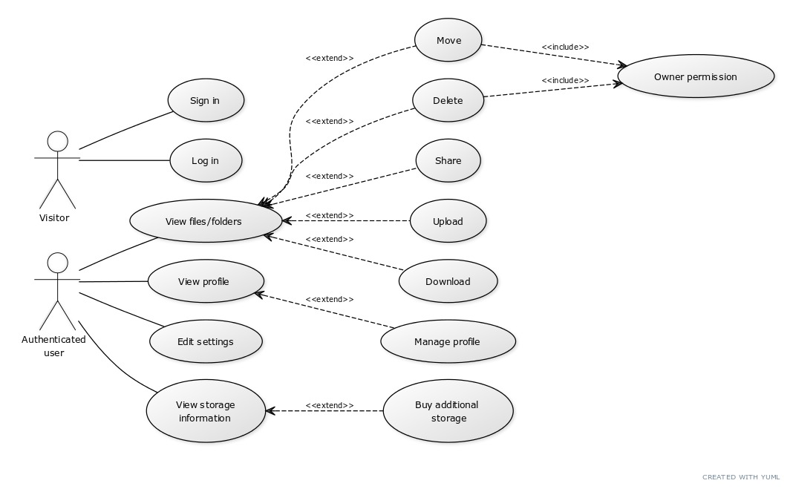

# Cloud Storage System

A cloud-based system that allows users to store their files on the cloud.
This project is only meant as an assignment.

## The problem

With normal physical storage:

- people can't access their files from wherever they are
- people have limited space for their files
- people constantly risk losing their files in case their storage device fails

This software solves these problems by moving the storage to the cloud and allowing users to safely access their data from the web.

## Requirements

*(The following requirements are flagged [F] for functional and [N] for non-functional)*

The system must allow users to (*user requirements*):

- create an account with a custom nickname and profile picture [F]
- view, upload, download and delete files and folders [F]
- share their files and folders with other users [F]
- view "last modified time" and owner of each file and folder [F]
- pay for additional storage space [F]

In more detail (*system requirements*):

- the system must be distributed [N]
- the system must have a web-based frontend and a backend [N]
- nicknames must be unique [N]
- all files must be downloadable [F]
- whole folders must be downloadable [F]
- uploaded files must not be larger than a set maximum size [N]
- deleted files must not be immediately deleted, instead they must be moved to the trash [F]
- it must be possible to empty the trash either manually or automatically after a set amount of time [F]
- owners of a file or folder must be able to perform any action on it [F]
- non-owners of a shared file or shared folder must not be able to perform any action on it, but must be able to solely view it [F]
- when sharing a file or folder, the nickname must be used to identify users to share it to [F]

### Use case diagram

