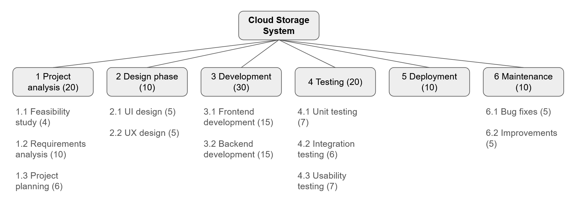

# Cloud Storage System

> ### ***Store, share and protect your files from anywhere, at any time.***

This cloud-based system will give you all the tools you need to manage your files efficiently, with a user-friendly interface designed for seamless navigation and organization. From uploading and organizing to sharing and collaborating, you will be able to handle your files effortlessly, maximising your workflow and productivity.

The key benefits of the service are:
- **Unlimited Storage**: Store an unlimited amount of data without worrying about running out of space, allowing you to scale your storage needs without any limit.
- **Data Protection**: Your files are safe with advanced security measures guaranteeing the safety, privacy, and accessibility of your data.
- **Ease Of Use**: Satisfy all your needs with just a few clicks thanks to a user-friendly interface designed with usability and accessibility in mind.

***Note:** This project is only meant as an assignment.*

## The problem

With normal physical storage:

- people can't access their files from wherever they are
- people have limited space for their files
- people constantly risk losing their files in case their storage device fails

This software solves these problems by moving the storage to the cloud and allowing users to safely access their data from the web.

## Requirements

*(The following requirements are flagged [F] for functional and [N] for non-functional)*

The system must allow users to (*user requirements*):

- create an account with a custom nickname and profile picture [F]
- view, upload, download and delete files and folders [F]
- share their files and folders with other users [F]
- view "last modified time" and owner of each file and folder [F]
- pay for additional storage space [F]

In more detail (*system requirements*):

- the system must be distributed [N]
- the system must have a web-based frontend and a backend [N]
- nicknames must be unique [N]
- all files must be downloadable [F]
- whole folders must be downloadable [F]
- uploaded files must not be larger than a set maximum size [N]
- deleted files must not be immediately deleted, instead they must be moved to the trash [F]
- it must be possible to empty the trash either manually or automatically after a set amount of time [F]
- owners of a file or folder must be able to perform any action on it [F]
- non-owners of a shared file or shared folder must not be able to perform any action on it, but must be able to solely view it [F]
- when sharing a file or folder, the nickname must be used to identify users to share it to [F]

### Use case diagram

,[Visitor]%20-%20(Log%20in),[Authenticated%20user]%20-%20(View%20files/folders),(View%20files/folders)%20%3C%20(Download),(View%20files/folders)%20%3C%20(Upload),(View%20files/folders)%20%3C%20(Share),(View%20files/folders)%20%3C%20(Delete),(View%20files/folders)%20%3C%20(Move),(Move)%20%3E%20(Owner%20permission),(Delete)%20%3E%20(Owner%20permission),[Authenticated%20user]%20-%20(View%20profile),(View%20profile)%20%3C%20(Manage%20profile),[Authenticated%20user]%20-%20(Edit%20settings),[Authenticated%20user]%20-%20(View%20storage%20information),(View%20storage%20information)%20%3C%20(Buy%20additional%20storage) "Use case diagram")

### Work breakdown structure (WBS)

## User stories

- **As an** unregistered user, **I want** to create a new account on the platform **so that** I can access and use the service.
- **As a** registered user, **I want** to upload files to my storage online **so that** I can access them from anywhere at anytime.
- **As a** registered user, **I want** to download files from my storage online **so that** I can use them on my local machine.
- **As a** registered user, **I want** to search for files, **so that** I can quickly retrieve the ones I need.
- **As a** registered user, **I want** to share some of my files and folders **so that** specific users can access them.
- **As a** registered user, **I want** to buy more storage **so that** I can save a larger amount of files online.

## Pivot

After studying the market for cloud applications, I learned that the for the system to gain relevance among the competitors, it should implement a multitenant approach.

Luckily for me, this application already has a multitenant architecture, namely:
- a single infrastructure stores data for many users (tenants).
- each user has their own designated storage space and cannot access other users' data.

This architecture also has the advantage of being relatively cost-effective as the infractructure is shared among all users.
